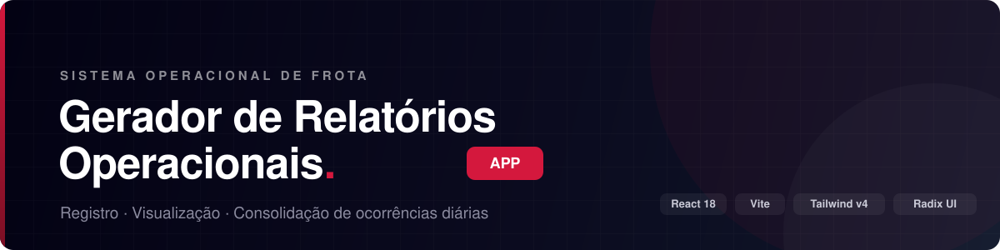

<div align="center">



<br/>
<br/>

**Interface para registro, visualização e consolidação de ocorrências operacionais de viagens e frotas.**

<br/>

[](https://react.dev)
[](https://www.typescriptlang.org)
[](https://vite.dev)
[](https://tailwindcss.com)
[](https://tanstack.com/query)

</div>

<div align="center">

`Radix UI` &nbsp;•&nbsp; `MUI` &nbsp;•&nbsp; `TipTap` &nbsp;•&nbsp; `Recharts` &nbsp;•&nbsp; `react-dnd` &nbsp;•&nbsp; `Motion`

</div>

---

## Sobre o projeto

SPA em **React + TypeScript** para o registro diário de ocorrências de motoristas e frotas, com fluxo completo de criação, edição rica de relato, anexos de evidências, consolidação em relatório diário e geração de PDF.

Consome a API [`Gerador-de-Relatorios-Operacionais-api`](https://github.com/luc118i/Gerador-de-Relatorios-Operacionais-api).

---

## Funcionalidades

| | |
|---|---|
| **Nova ocorrência** | Formulário validado com vínculo de motorista, linha/viagem e local |
| **Editor rico** | Relato com formatação via TipTap (negrito, cor, sublinhado) |
| **Evidências** | Upload múltiplo com pré-visualização em galeria/masonry |
| **Central de ocorrências** | Quadro Kanban por fases com drag-and-drop |
| **Relatório diário** | Consolidação do dia e exportação em PDF |
| **Análise de telemetria** | Importação de planilhas e visualização em gráficos |
| **Cadastros** | Motoristas, esquemas de rota, locais e base de responsáveis |
| **Tema claro/escuro** | Tokens de design em `oklch` com `next-themes` |

---

## Stack de tecnologias

<table>
<tr>
<td valign="top" width="50%">

**Core**
- React 18 · TypeScript 5.6
- Vite 6

**Dados e estado**
- TanStack Query
- Supabase JS
- React Hook Form

**UI**
- Tailwind CSS v4
- Radix UI · MUI (`@mui/material`)
- lucide-react · Motion

</td>
<td valign="top" width="50%">

**Conteúdo e visualização**
- TipTap (editor de texto rico)
- Recharts (gráficos)
- react-dnd (Kanban)
- embla-carousel · react-responsive-masonry

**Utilitários**
- date-fns · date-fns-tz
- xlsx-js-style (import/export de planilhas)
- sonner (toasts) · cmdk

</td>
</tr>
</table>

---

## Arquitetura

Arquitetura modular, separando dados, regras de negócio e interface.

```
src/
├── api/            # Infraestrutura HTTP e serviços de busca
│   ├── http/       # Cliente e configurações globais
│   └── *.api.ts    # drivers, occurrences, reports...
│
├── app/            # Camada de visualização (UI)
│   ├── components/ # Componentes reutilizáveis
│   ├── pages/      # Páginas principais
│   ├── context/    # Providers de aplicação
│   └── lib/        # Helpers de UI e formatação
│
├── domain/         # Tipagens, interfaces e DTOs
│
├── features/       # Módulos isolados por funcionalidade
│   ├── occurrences/  # Ocorrências (queries, payloads, keys)
│   ├── central/      # Central de ocorrências (Kanban)
│   ├── report/ ·  reportsPdf/   # Relatório diário e PDF
│   ├── telemetry/    # Análise de telemetria
│   └── trips/        # Linhas e viagens
│
├── catalogs/       # Dados estáticos e catálogos
├── hooks/ · utils/ · lib/   # Recursos compartilhados
└── styles/         # Tema global (theme.css) e Tailwind
```

**Camadas**

- **api** — centraliza a comunicação com o backend; o resto do app não conhece endpoints.
- **app** — onde o React vive; foca em *como* os dados aparecem.
- **domain** — a "verdade" dos dados; mudou o contrato, muda aqui primeiro.
- **features** — organiza por domínio de funcionalidade em vez de tipo de arquivo.

---

## Como executar

### Pré-requisitos

- Node.js 20+
- API rodando localmente ou URL de API acessível

### Variáveis de ambiente

Crie um `.env` a partir do `.env.development`:

```env
VITE_API_URL=
VITE_ADMIN_PIN=
VITE_GOOGLE_CLIENT_ID=
VITE_SUPABASE_URL=
VITE_SUPABASE_ANON_KEY=
VITE_ESQUEMAS_API_URL=
VITE_ESQUEMAS_SITE_URL=
```

### Instalação e desenvolvimento

```bash
npm install
npm run dev
```

### Build e preview

```bash
npm run build      # roda typecheck + vite build
npm run preview
```

---

## Design system

O tema fica em [`src/styles/theme.css`](src/styles/theme.css), com tokens em `oklch` e suporte a modo escuro via classe `.dark`.

| Token | Valor | Uso |
|-------|-------|-----|
| `--primary` | `#030213` | Ações principais, texto de destaque |
| `--destructive` | `#d4183d` | Erros e ações irreversíveis |
| `--muted-foreground` | `#717182` | Texto secundário |
| `--radius` | `0.625rem` | Raio base dos componentes |
| Fonte | `Hanken Grotesk` | Interface (via Google Fonts) |

---

<div align="center">
<sub>Desenvolvido para otimização de processos logísticos · <a href="https://github.com/luc118i">luc118i</a></sub>
</div>
